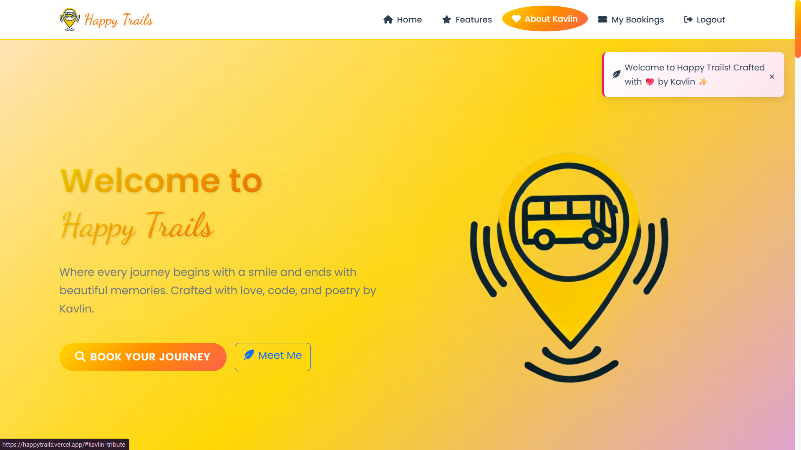

  <div align="center">
    
  </div>

<div align="center"></div>

# <div align="center">HAPPY TRAILS</div>

  <div align="center">
    
  </div>


# 📑 **Table of Contents**

* 🚀 [Overview](#-a-cosmic-bus-booking-experience)
* 🌌 [Vision: Human-Centered Travel Technology](#-vision-human-centered-travel-technology)
* ✨ [Features](#-features)
* 🌟 [Stand-Out Experience Features](#-stand-out-experience-features)

  * 🎭 [Narrative & Poetic Interface](#1-narrative--poetic-interface)
  * 📡 [Live Tracking & Weather Integration](#2-live-tracking--weather-integration)
  * 🪄 [Interactive Frontend Magic](#3-interactive-frontend-magic)
  * 🐣 [Hidden Easter Eggs](#4-hidden-easter-eggs)
* 📺 [Video Explanation](#-video-explanation)
* 🛠️ [Technologies Used](#-technologies-used)
* ⚙️ [Installation and Setup](#️-installation-and-setup)
* 🪪 [.env Requirements](#required-env-file)
* 🐞 [Issue Creation](#issue-creation-)
* 📑 [Contribution Guidelines](#contribution-guidelines-)
* 👥 [Contributors](#-contributors)
* 📄 [License](#-license)
* 📞 [Contact](#-contact)

---


## 🚌 A Cosmic Bus Booking Experience

**Happy Trails** is a poetic, modern bus booking platform where every journey is treated as a magical, cosmic adventure. It transforms the transactional process of booking a ticket into an immersive experience. It blends robust functionality (user accounts, real-time search, interactive seat selection, and live tracking) with an emotional UX—infusing micro‑poetry, glowing gradients, glass morphism, and a narrative-led design.

> “Every confirmed ticket is a cosmic promise that tomorrow holds a sunrise worth chasing across dimensions.” – Kavlin ✨

---

## 🌌 Vision: Human-Centered Travel Technology

Travel isn’t just about getting from one point to another—it's about the anticipation, the journey, and the memories. Traditional booking portals feel sterile and impersonal. Happy Trails reframes this interaction as an exciting and beautiful first step of an adventure.

### The Happy Trails Difference

| Pillar | What It Means | How Happy Trails Expresses It |
|--------|---------------|--------------------------|
| **Joyful UX** | Interfaces should inspire delight. | Poetic micro-copy, celebratory animations, and a magical theme. |
| **Reliability** | Technology must be dependable. | A robust Flask backend, real-time data, and secure user sessions. |
| **Discovery** | The platform should feel exploratory. | "Cosmic" destination carousels and live maps make planning fun. |
| **Inspiration**| Travel is a story. | Quotes, thematic gradients, and narrative motifs like "Cosmic Chariot". |

## 🚀 Live Demo

Experience Happy-Trails live here: 
👉 [](https://HappyTrails.vercel.app/)

 <div align="center">
 <p>

[](https://github.com/ellerbrock/open-source-badges/)


 </p>
 </div>

<div align="center">
  
  <br>
</div>

## ✨ Features 
<div align="center">
  
</div>

| Domain | Features | Status |
|--------|----------|--------|
| **Authentication** | Multi-step Signup, Secure Login, Password Strength Meter, Session Persistence. | ✅ |
| **Booking Flow** | Search (Origin/Destination/Date), Dynamic Results, Sorting (Price/Time). | ✅ |
| **Seat Selection** | Interactive Graphical Seat Map, Real-time Price Calculation, Hover Effects. | ✅ |
| **Payment** | Multi-method Payment UI, Secure Confirmation Step, Celebratory Animations. | ✅ |
| **User Dashboard** | "My Cosmic Journeys" page to view all bookings (past & upcoming). | ✅ |
| **Booking Mgmt.**| Dynamic Filtering (Status/Month/Search), One-click Cancellation for upcoming trips. | ✅ |
| **Live Tracking** | Real-time (mocked) Bus Tracking on an interactive Leaflet.js Map. | ✅ |
| **API Integration**| OpenWeatherMap API for destination weather display. | ✅ |
| **UI/UX System** | Glass morphism, Gradients, Micro-animations, Poetic meta-text, Custom Toasts. | ✅ |
| **Convenience** | "Recent Searches" functionality using browser `localStorage`. | ✅ |
| **Easter Eggs** | Hidden Konami Code and other interactive secrets. | ✅ |

---

## 🌟 Stand-Out Experience Features

### 1. Narrative & Poetic Interface  
Happy Trails frames the booking process as a **journey**. Terms like "Cosmic Chariot," "Quantum Scheduling," and "Interdimensional Journey" are used to create an emotional and memorable user experience.

### 2. Live Tracking & Weather Integration  
A dedicated tracking page uses **Leaflet.js** to show the bus's position in real-time. It enhances the experience by pulling live weather data for the destination city from the **OpenWeatherMap API**, helping travelers prepare for their arrival.

### 3. Interactive Frontend Magic
The frontend is filled with JavaScript-driven enhancements:
- **Celebratory Effects:** Confirming a booking triggers a screen full of confetti and floating emojis.
- **Dynamic Updates:** The seat selection sidebar updates prices and seat numbers instantly without a page reload.
- **Custom Animations:** The entire UI is animated with CSS, from floating background orbs to buttons that provide satisfying tactile feedback on hover and click.

### 4. Hidden Easter Eggs
To add a layer of fun and discovery, the application includes hidden secrets, such as a **Konami code** that reveals a special message from the creator, Kavlin.

## 📺 Video Explanation

For a detailed walkthrough of Happy-Trails's features and how to use them, check out this video:

**[Video Coming Soon]**

---

## 🛠️ Technologies Used


---
## 📁PROJECT STRUCTURE-
Happy-Trails/
├── .github/                   # GitHub workflows (PR automation, issue comments, etc.)
│    |-ISSUE_TEMPLATE
|    |-workflows
|    |-pull/-request_template.md
├── __pycache__/               # Python bytecode cache
│    |-app.cypthon-312.pyc
├── instance/                  # Flask instance folder (runtime configs)
│    |-happytrails.db
├── static/                    # Static files (CSS, JS, images)
│    |--css/
|    |  |-main.css
|    |  |-poetry_cornor.css
|    |  |-route_explorer.css
|    |  |-travel_companions.css
|    |  |-travel_gallery.css
|    |
|    |--images/
|    |  |-barog.avif
|    |  |-bus-market.png
|    |  |-(...more images)
|    |  
|    |--js/
|    |  |main.js
|    |  |poetry_cornor.js
|    |  |route_explorer.js
|    |  |travel_companions.js
|    |__|travel_gallery.js
|    
├── templates/                 # HTML templates
|    |--features/
|    |  |-poetry_cornor.html
|    |  |-route_explorer.html
|    |  |-travel_companions.html
|    |  |-travel_gallery.html
|    |  
|    |--footer/
|    |  |-cookie_policy.html
|    |  |-copyright.html
|    |  |-disclaimer.html
|    |  |-newsletter.html
|    |  |-privacy.html
|    |  |-terms.html
|    |-base.html
|    |-book_bus.html
|    |-booking_confirmation.html
|    |-bus_results.html
|    |-index.html
|    |-login.html
|    |-my_bookings.html
|    |-payments.html
|    |-select_bus.html
|    |-select_seats.html
|    |-signup.html
|    |_track_bus.html
│
├── .gitignore                 # Git ignore rules
├── App.png                    # Project screenshot
├── CODE_OF_CONDUCT.md         # Community guidelines
├── CONTRIBUTING.md            # Contribution guide
├── LICENSE                    # Open-source license
├── Logo.jpg                   # Project logo
├── README.md                  # Project documentation
│
├── app.py                     # Main Flask application
│
├── package.json               # Node package file (JS tooling)
├── package-lock.json          # Dependency lock file
│
├── requirements.txt           # Python dependencies
└── vercel.json                # Deployment configuration


---

## ⚙️ Installation and Setup

```bash
# 1. Clone the repository
git clone [https://github.com/your-username/happy-trails.git](https://github.com/your-username/happy-trails.git)
cd happy-trails

# 2. Create and activate a virtual environment
# On macOS/Linux:
python3 -m venv venv
source venv/bin/activate
# On Windows:
python -m venv venv
.\venv\Scripts\activate

# 3. Install dependencies
pip install -r requirements.txt

# 4. Create a .env file and add your keys (see below)

# 5. Run the development server
flask run

# 6. Visit the application
[http://127.0.0.1:5000](http://127.0.0.1:5000)
````

### Required `.env` File

```
HAPPYTRAILS_SECRET_KEY='a_very_secret_and_random_string_for_security'
DATABASE_URL='sqlite:///instance/happytrails.db'
GOOGLE_MAPS_API_KEY='YOUR_GOOGLE_MAPS_API_KEY'
WEATHER_API_KEY='YOUR_OPENWEATHER_API_KEY'
```

---

## Issue Creation ✴
Report bugs and  issues or propose improvements through our GitHub repository.

## Contribution Guidelines 📑

<div align="center">
  
</div>

- Firstly Star(⭐) the Repository
- Fork the Repository and create a new branch for any updates/changes/issue you are working on.
- Start Coding and do changes.
- Commit your changes
- Create a Pull Request which will be reviewed and suggestions would be added to improve it.
- Add Screenshots and updated website links to help us understand what changes is all about.

- Check the [CONTRIBUTING.md](CONTRIBUTING.md) for detailed steps...
    
## Contributing is fun🧡

We welcome all contributions and suggestions!
Whether it's a new feature, design improvement, or a bug fix — your voice matters 💜

Your insights are invaluable to us. Reach out to us team for any inquiries, feedback, or concerns.

## 👥 Contributors

Thanks to these wonderful people for contributing 💖

[](https://github.com/Kavlin-Kaur/Happy-Trails/graphs/contributors)

## 📄 License

This project is open-source and available under the [MIT License](LICENSE).

## 📞 Contact

Developed by [Kavlin](https://kavlin-kaur.github.io/kavres/)

Feel free to reach out with any questions or feedback\! Thanks for reading, here's a cookiepookie:


